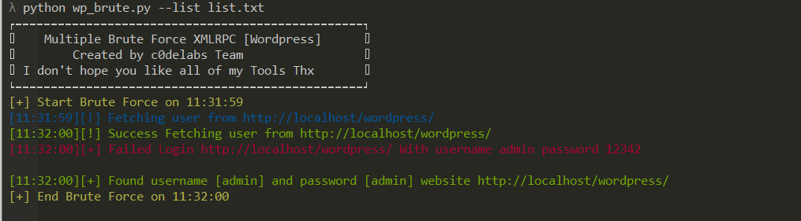

## Multiple Brute Force XMLRPC [Wordpress] 
<a href="http://c0delabs.com/"></a>

### Clone

- Clone this repo to your local machine using `git clone https://github.com/galehrizky/wp-brute-xmlrpc.git`

### Install

```shell
$ cd wp-brute-xmlrpc
$ pip install -r requirements.txt
```

### Usage (Python 3)

```shell
$ python wp_brute.py -h
```


## License

[](http://badges.mit-license.org)

- **[MIT license](http://opensource.org/licenses/mit-license.php)**
- Copyright 2019 © <a href="http://c0delabs.com/" target="_blank">c0delabs.com</a>.
